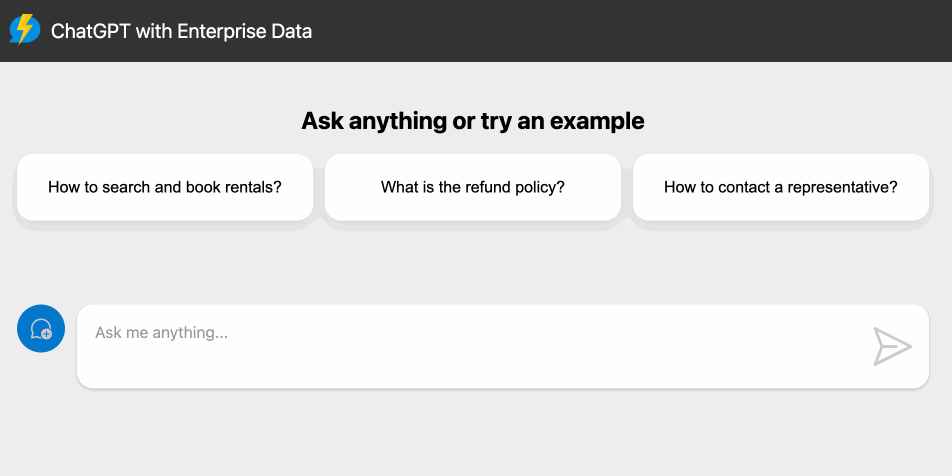
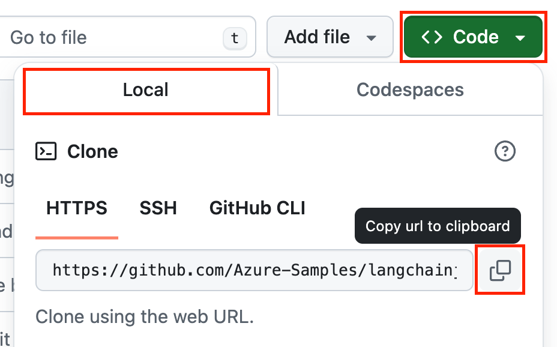
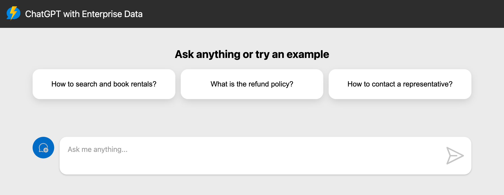
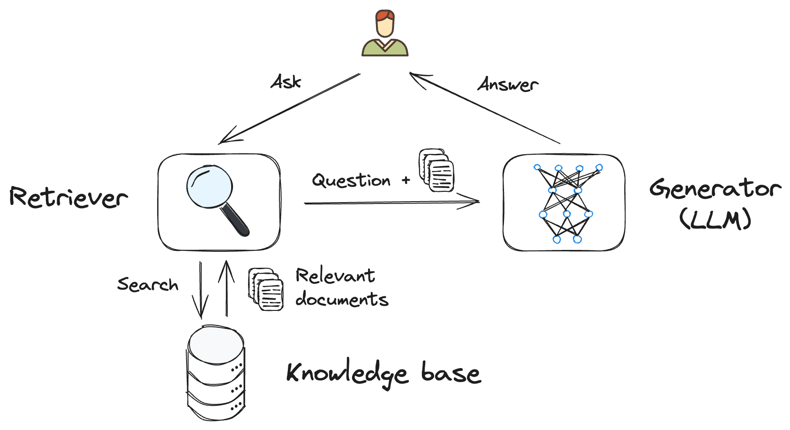
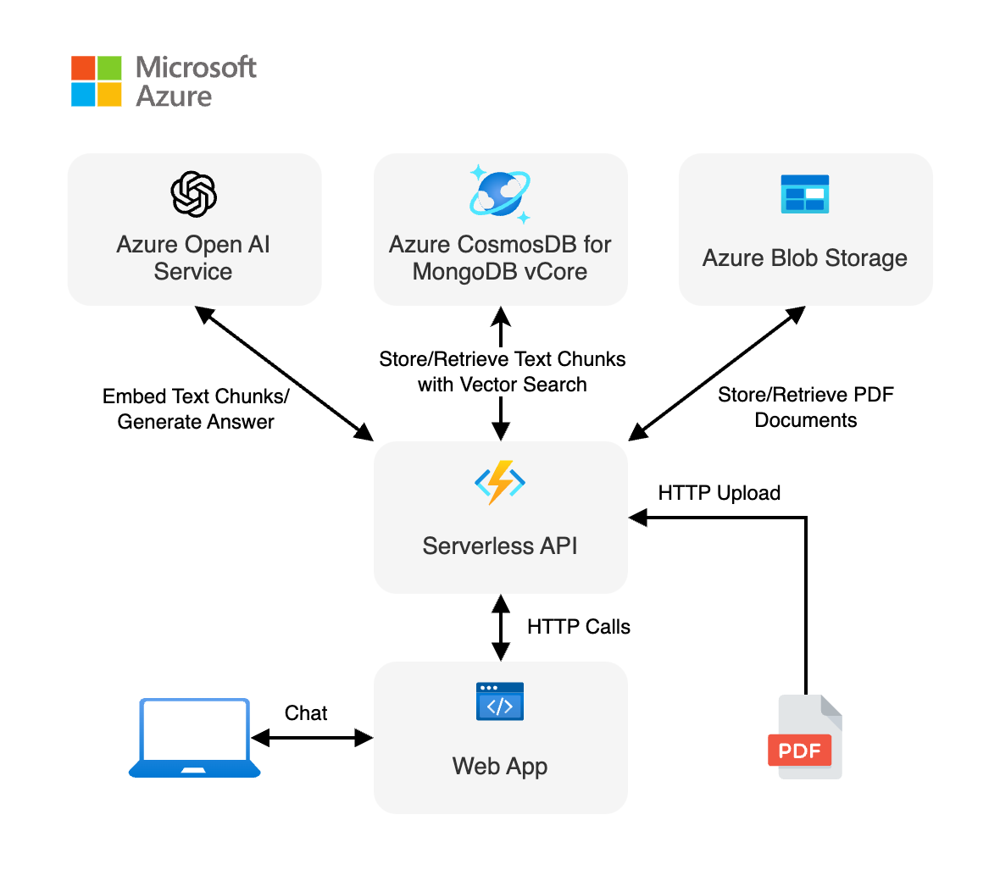

We're still at the beginning of exploring what we can do with generative AI, and the field is moving fast, very fast!

And when things move fast, you need to be able to experiment and iterate quickly. First to validate your ideas with a prototype, then to scale up to production if it works.

In this article, we'll show you how LangChain.js, Ollama with Mistral 7B model and Azure can be used together to build a serverless chatbot that can answer questions using a RAG (Retrieval-Augmented Generation) pipeline. We'll see first how you can work fully locally to develop and test your chatbot, and then deploy it to the cloud with state-of-the-art OpenAI models.

Here's a preview of the final project:



Grab your favorite beverage ☕, and let's dive in!

## TL;DR key takeaways

- LangChain.js provides abstraction over AI models and APIs, allowing you to switch between them easily. Built-in support for advanced chains components makes complex AI workflows like RAG easy to build.
- Ollama is a powerful tool to experiment with AI models and embeddings locally.
- Azure Cosmos DB for MongoDB vCore can be used as a vector database for AI workloads, in addition to your regular NoSQL storage.

Here is the final project [source code on GitHub](https://github.com/Azure-Samples/serverless-chat-langchainjs).

If you like the project, don't forget to give it a star ⭐️!

## What will you learn here?

In this article, we will:
- Install required tools and set up the project
- Use Ollama to experiment with the Mistral 7B model on your local machine
- Run the project locally to test the chatbot
- Explain the RAG pipeline and how it can be used to build a chatbot
- Walk through LangChain.js building blocks to ingest the data and generate answers
- Deploy the chatbot to Azure Functions, using Azure Cosmos DB for MongoDB as a vector database (optional)

As you can see, we have a lot to cover so feel free to take your time and experiment with the code as you go through the article.

### Reference links for everything we use

- [LangChain.js](https://js.langchain.com)
- [Ollama](https://ollama.com/)
- [Azure Static Web Apps](https://learn.microsoft.com/azure/static-web-apps/)
- [Azure Functions](https://learn.microsoft.com/azure/functions/)
- [Azure Cosmos DB for MongoDB vCore](https://learn.microsoft.com/azure/cosmos-db/mongodb/vcore/)
- [Azure Developer CLI](https://aka.ms/azure-dev/install)

## Requirements

- A working [Node.js v20+](https://nodejs.org) environment
- A machine with [a GPU supported by Ollama](https://github.com/ollama/ollama/blob/main/docs/gpu.md)
- [Git](https://git-scm.com/downloads)
- [A GitHub account](https://github.com/join) 
- (Optional, for Azure deployment) An Azure account to create the resources and deploy the app. If you don't have an account, you can [create one for free using this link](https://azure.microsoft.com/free/?WT.mc_id=javascript-0000-cxa). If you're a student, you can also get free credits with [Azure for Students](https://aka.ms/azureforstudents).

## Getting started

First let's fork and clone the project repository on your machine. This will allow you to experiment with the code and make changes as you go through the article.

1. Open the following link, then select **Create fork** button: [**Fork on GitHub**](https://github.com/Azure-Samples/serverless-chat-langchainjs/fork)
2. On your forked repository, select the **Code** button, then the **Local** tab, and copy the URL of your forked repository.
    
3. Open a terminal and run this command to clone the repo: `git clone <your-repo-url>`

In a terminal, navigate to the project folder and install the dependencies with:

```bash
npm install
```

It's almost ready! Before running the app, we need first have to setup Ollama to have a local AI playground.

## Install Ollama and local models

Ollama is a CLI tool that allows you to experiment with AI models and embeddings locally. It's a great tool to test and validate your ideas before deploying them to the cloud.

Go to [Ollama's website](https://ollama.com/download) and download the latest version for your platform. Once installed, you can use the `ollama` command in your terminal.

We'll start by downloading the models we need for this project. Run the following commands in your terminal:

```bash
ollama pull mistral
ollama pull all-minilm:l6-v2
```

This will pull the Mistral 7B model, a powerful language model that we'll use for the chatbot, and the All-MiniLM model, a small embedding model that we'll use to generate the vectors from the text.

> **Note:** The `mistral` model with download a few gigabytes of data, so it can take some time depending on your internet connection.

Once the models are downloaded, you can test that the Ollama server is working correctly by running:

```bash
ollama run mistral
```

You should get an invite in your terminal, where you can chat with the AI model directly, like a minimal chatbot:


Try asking a few questions to the model, and see how it responds. This will give you a good idea of the capabilities of the model and how you can interact with it.

Once you're done, you can stop the Ollama server by pressing `Ctrl+D` in your terminal.

## Running the project locally

Now that we have the models ready, we can run the project to test the chatbot. Open a terminal in the project root and run:

```bash
npm start
```

This will start a dev server for the frontend, and an Azure Functions runtime emulator for the backend. You can access and play with the chatbot at [http://localhost:8000](http://localhost:8000).

> **Note:** The first time you run the project, it can take a few minutes to start the backend API as it will download the runtime dependencies.

You should end up with a familiar chat interface, where you can ask questions and get answers from the chatbot:



For this demo, we use a fictitious company called _Contoso Real Estate_, and the chatbot can answer support questions about the usage of its products. The sample data includes a set of documents that describes its terms of service, privacy policy and a support guide.

You can try using the suggested questions, or ask your own questions to see how the chatbot responds. Try also asking something completely out of context, like "Who won the latest football world cup?" to see how the chatbot handles it.

## Understanding the RAG pipeline

The chatbot we built uses a RAG (Retrieval-Augmented Generation) pipeline to answer questions. But what is RAG?

RAG is a method used in artificial intelligence, particularly in natural language processing, to generate text responses that are both contextually relevant and rich in content using AI models.

At its core, RAG involves two main components:

- **Retriever**: Think "_like a search engine_", finding relevant information from a knowledgebase, usually a vector database. In this sample, we're using Azure CosmosDB for MongoDB vCore as our vector database.

- **Generator**: Acts like a writer, taking the prompt and information retrieved to create a response. We're using here a Large Language Model (LLM) for this task.



When you ask a question to the chatbot, the RAG pipeline works like this:

1. The question is sent to the retriever, which will find the most relevant documents in the knowledgebase.
2. We used the top *N* retrieved documents along with the question to generate a prompt for the generator.
3. The generator (here the AI model) will then use the prompt to generate a response, which is sent back to the user.

## Exploring the LangChain.js building blocks

To build the RAG pipeline, we're using LangChain.js, a library that provides an abstraction layer over AI models but also comes with advanced chain components to build AI workflows, including RAG.

We'll now dive into the code to understand the various parts of the pipeline, and the components we used to implement it.

Our backend API is composed of two main endpoints:

- `/documents`: This endpoint allows to upload a PDF documents in the database, performing text extraction and vectorization as part of the ingestion process.

- `/chat`: This endpoint receives a list of messages, the last being the user query and returns a response generated by the AI model. It uses the documents stored in the database to generate the response.

### The `/documents` endpoint

Here we use LangChain.js to extract the text from the PDF file, split it into smaller chunks, and generate vectors for each chunk. We store the text and the vectors in the database for later use in our RAG pipeline.

Open the file `packages/api/src/functions/documents-post.ts` in your code editor.
Let's analyse the main parts of `postDocuments()` function:

```typescript
// Get the uploaded file from the request
const parsedForm = await request.formData();

if (!parsedForm.has('file')) {
  return badRequest('"file" field not found in form data.');
}

const file = parsedForm.get('file') as File;
const filename = file.name;
```

We start by parsing the form data to get the uploaded PDF file name and content. We use the standard MIME type `multipart/form-data` to handle file uploads here.

```typescript
// Extract text from the PDF
const loader = new PDFLoader(file, {
  splitPages: false,
});
const rawDocument = await loader.load();
rawDocument[0].metadata.filename = filename;

// Split the text into smaller chunks
const splitter = new RecursiveCharacterTextSplitter({
  chunkSize: 1500,
  chunkOverlap: 100,
});
const documents = await splitter.splitDocuments(rawDocument);
```

Next we use LangChain.js components to perform the text extraction and splitting. We use the `PDFLoader` to extract the text from the PDF file, and the `RecursiveCharacterTextSplitter` to split the text into smaller chunks.

Splitting the text into smaller chunks is important to improve the retrieval performance, as it allows the retriever to find more relevant information in the documents. It also helps with the AI models' limitations on the prompt input size, and ultimately reduces the usage cost when using hosted cloud models.

```typescript
// Generate embeddings and save in database
if (azureOpenAiEndpoint) {
  const store = await AzureCosmosDBVectorStore.fromDocuments(documents, new AzureOpenAIEmbeddings(), {});
  await store.createIndex();
  await store.close();
} else {
  // If no environment variables are set, it means we are running locally
  context.log('No Azure OpenAI endpoint set, using Ollama models and local DB');
  const embeddings = new OllamaEmbeddings({ model: ollamaEmbeddingsModel });
  const store = await FaissStore.fromDocuments(documents, embeddings, {});
  await store.save(faissStoreFolder);
}
```

Now is the most important part: we generate the embeddings for each chunk of text and store them in the database. LangChain.js abstracts a lot of the complexity here, allowing us to switch between different embeddings models easily. Here we use the Azure OpenAI embeddings for the cloud deployment, and the Ollama embeddings for the local development. You can see that it's easy to switch between the two as LangChain.js provides a common interface for both.

```typescript
if (connectionString && containerName) {
  // Upload the PDF file to Azure Blob Storage
  context.log(`Uploading file to blob storage: "${containerName}/${filename}"`);
  const blobServiceClient = BlobServiceClient.fromConnectionString(connectionString);
  const containerClient = blobServiceClient.getContainerClient(containerName);
  const blockBlobClient = containerClient.getBlockBlobClient(filename);
  const buffer = await file.arrayBuffer();
  await blockBlobClient.upload(buffer, file.size, {
    blobHTTPHeaders: { blobContentType: 'application/pdf' },
  });
} else {
  context.log('No Azure Blob Storage connection string set, skipping upload.');
}
```

Finally, we upload the original PDF file to Azure Blob Storage. This is useful to keep a copy of the documents, and also to provide a way to download them later if needed. But it's not mandatory for the chatbot to work, so we can skip it entirely if we're running locally.

### The `/chat` endpoint

In this endpoint we use LangChain.js components to connect to the database, load the documents and perform a vector search after vectorizing the user query. After that, the most relevant documents are injected into the prompt, and we generate the response. While this process seems complex, LangChain.js does all the heavy lifting for us.

Open the file `packages/api/src/functions/chat-post.ts` in your code editor.
Let's skip to the most interesting part of the `postChat()` function:

```typescript
let embeddings: Embeddings;
let model: BaseChatModel;
let store: VectorStore;

if (azureOpenAiEndpoint) {
  // Initialize models and vector database
  embeddings = new AzureOpenAIEmbeddings();
  model = new AzureChatOpenAI();
  store = new AzureCosmosDBVectorStore(embeddings, {});
} else {
  // If no environment variables are set, it means we are running locally
  context.log('No Azure OpenAI endpoint set, using Ollama models and local DB');
  embeddings = new OllamaEmbeddings({ model: ollamaEmbeddingsModel });
  model = new ChatOllama({ model: ollamaChatModel });
  store = await FaissStore.load(faissStoreFolder, embeddings);
}
```

We start by initializing the AI models and the database. As you can see switching between the cloud and local models is straightforward, and the good news is that it's the only change needed!

```typescript
// Create the chain that combines the prompt with the documents
const combineDocsChain = await createStuffDocumentsChain({
  llm: model,
  prompt: ChatPromptTemplate.fromMessages([
    ['system', systemPrompt],
    ['human', '{input}'],
  ]),
  documentPrompt: PromptTemplate.fromTemplate('{filename}: {page_content}\n'),
});
```

The first part of our RAG chain is using the `createStuffDocumentsChain()` function to combine the prompt with the documents. We use the templating features of LangChain.js to create the differents parts of the prompt:

- The *system prompt*, which is a fixed message that we inject at the beginning of the prompt. You can have a look at it to understand the different parts of what it does and what it contains. The most important part is the `{context}` placeholder at the end, which will be replaced by the retrieved documents.

- The *human prompt*, which is the user query. We use the `{input}` placeholder to inject the user query into the prompt.

- The *document prompt*, which is used to format how we inject the retrieved documents into the system prompt. Our format is simple here, we just prepend the document filename to the content of the page.

```typescript
// Create the chain to retrieve the documents from the database
const chain = await createRetrievalChain({
  retriever: store.asRetriever(),
  combineDocsChain,
});
```

The next part of our chain is the retrieval of the documents from the database. The `createRetrievalChain()` abstracts the process entirely: we just need to provide the retriever and the combineDocsChain, and it will take care of the rest. It will do a few things behind the scenes:

1. Convert the user query into a vector using the embeddings model.
2. Performs a vector search in the database to find the most relevant documents.
3. Injects the most relevant documents into the **context** of the chain.
4. Passes the context to our previous `combineDocsChain` to generate the prompt.

```typescript
// Generate the response
const lastUserMessage = messages.at(-1)!.content;
const responseStream = await chain.stream({
  input: lastUserMessage,
});

return data(createStream(responseStream), {
  'Content-Type': 'application/x-ndjson',
  'Transfer-Encoding': 'chunked',
});
```

Finally, the last part of the chain is to generate the response using `chain.stream()` and passing the last user message, containing the question, as input. The response is then streamed back to the client.

We use a stream of newline-delimited JSON (NDJSON) for the response, following the [AI Chat Protocol](https://github.com/Azure-Samples/ai-chat-app-protocol) as our API contract between the frontend and the backend.

## Deploying the chatbot to Azure (optional)

Now that we have a working chatbot locally, we can deploy it to Azure to make it accessible to the world. You've noticed how we handle the changes needed in the two endpoints to make the code work both locally and in the cloud.

When deployed, the project architecture will look like this:



We'll use Azure Functions to host the backend API, and Azure Static Web Apps to host the frontend. The Blob Storage will be used to store a copy of the original PDF documents, and Azure Cosmos DB for MongoDB vCore will be used as the vector database.

To deploy the application on Azure, you'll need a few things:

- An Azure account. If you don't have an account, you can [create one for free using this link](https://azure.microsoft.com/free/?WT.mc_id=javascript-0000-cxa). If you're a student, you can also get free credits with [Azure for Students](https://aka.ms/azureforstudents).
- An Azure subscription with access enabled for the Azure OpenAI service. You can request access with [this form](https://aka.ms/oaiapply).
- [Azure Developer CLI](https://aka.ms/azure-dev/install)

Once you have everything ready, you can deploy the project with the following steps:

1. Open a terminal at the root of the project.
2. Authenticate with Azure by running `azd auth login`.
3. Run `azd up` to deploy the application to Azure. This will provision Azure resources, deploy this sample, and build the search index based on the files found in the `./data` folder.
   - You will be prompted to select a base location for the resources. If you don't know which one to choose, you can select `eastus2`.
   - By default, the OpenAI resource will be deployed to `eastus2`. You can set a different location with `azd env set AZURE_OPENAI_RESOURCE_GROUP_LOCATION <location>`. Currently only a short list of locations is accepted. That location list is based on the [OpenAI model availability table](https://learn.microsoft.com/azure/ai-services/openai/concepts/models#standard-deployment-model-availability) and may become outdated as availability changes.

The deployment process will take a few minutes. Once it's done, you'll see the URL of the web app in the terminal.


You can now open the resulting link for the web app in your browser and start chatting with the bot.

If you're curious about the resources created, you can check them in the [Azure portal](https://portal.azure.com). You'll find a resource group with the following resources:


We used *Infrastructure as Code* to set up the resources, you can look into the `infra` folder to see the templates used to deploy the resources.

### Cleaning up the resources

To clean up all the Azure resources created and stop incurring costs, you can run the following command:

1. Run `azd down --purge`
2. When asked if you are sure you want to continue, enter `y`

The resource group and all the resources will be deleted.

## Going further

This was only an introduction to the possibilities of building AI-powered applications with LangChain.js and Azure (but still quite lengthy!). If you want to dig further into Generative AI or LangChain.js, here are some resources I recommend:

- [LangChain.js documentation](https://js.langchain.com): the official documentation for LangChain.js, with tutorials and examples to get you started.
- [Generative AI For Beginners](https://github.com/microsoft/generative-ai-for-beginners): a collection of resources to learn about Generative AI, including tutorials, code samples, and more.
- [Azure OpenAI Service](https://learn.microsoft.com/azure/ai-services/openai/overview): the official documentation for the Azure OpenAI Service, which provides access to the latest AI models from OpenAI.
- [Ask YouTube: LangChain.js + Azure Quickstart sample](https://github.com/Azure-Samples/langchainjs-quickstart-demo): another LangChain.js sample project that uses RAG to answer questions from YouTube videos.
- [Chat + Enterprise data with Azure OpenAI and Azure AI Search](https://github.com/Azure-Samples/azure-search-openai-javascript): an enterprise implementation of the chatbot, using Azure AI Search
- [Revolutionize your Enterprise Data with Chat: Next-gen Apps w/ Azure OpenAI and AI Search](https://aka.ms/entgptsearchblog): a blog post that explain the RAG approach using Azure OpenAI and Azure AI Search.

You can also find [more Azure AI samples here](https://github.com/Azure-Samples/azureai-samples).

---

Follow me on [Twitter](http://twitter.com/sinedied), I would be happy to discuss and take your suggestions!
