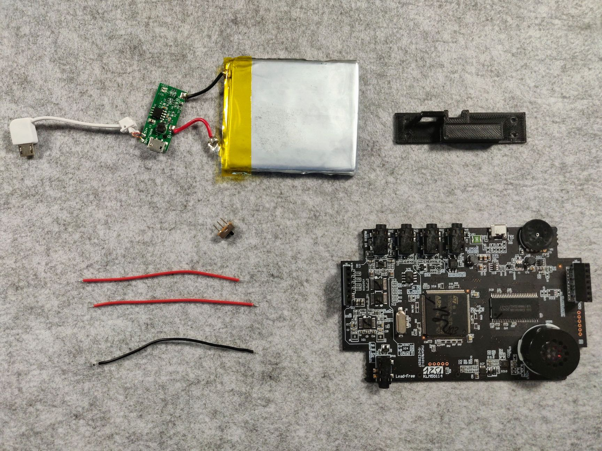

When I just got my hands on the [Korg NTS-1](https://www.korg.com/us/products/dj/nts_1/) mini synth, my first thought was: *« Why isn't there a battery in this thing? »*

This small synth has everything needed for making blips and blops on the go: powerful programmable oscillators and effects, a touch ribbon keyboard with arpeggiator and a speaker. But no built-in battery 😞.

Months later, I finally took the time to fix this, and here's the result:

This mod is based on an old repurposed USB battery I had, but I still get about 4-5h of battery time.

I've detailed all the steps below, so you can make the same modification to your own NTS-1.

## Materials and tools used

If you have the required tools, this mod should cost you about **10$** of materials. Here's everything you need:

- 1x Korg NTS-1 mini synth
- 1x [USB power bank in credit card format](https://fr.aliexpress.com/item/32809540226.html)
- 1x [Mini power switch](https://fr.aliexpress.com/item/4000938867866.html)
- 3x [PCB wire cable with a 10cm length](https://fr.aliexpress.com/item/32740871834.html)
- 1x [Replacement side panel](https://www.thingiverse.com/thing:4748960) (to 3D print)
- Solder wire
- Electrical tape
- Soldering iron
- Glue gun
- Screwdriver

You'll need to print [the replacement side planel](https://www.thingiverse.com/thing:4748960) using a 3D printer. If you don't have a 3D printer, you can ask a friend who have one or find a fab lab near your home.

## Prepare the parts

The first step is to disassemble your Korg NTS-1 and remove the main board. You don't need to unscrew everything for that, you only need to remove the back panel and loose the screws of the side panels where the connections are to be able to remove the board.

Then you have to pry open your USB battery to extract the USB board and battery out of the casing. You can use a small flat screwdriver for that. Once the case is open, remove the battery carefully as it's usually glued to the case.

##
