When I just got my hands on the [Korg NTS-1](https://www.korg.com/us/products/dj/nts_1/) mini synth, my first thought was: *« Why isn't there a battery in this thing? »*

This small synth has everything needed for making blips and blops on the go: powerful programmable oscillators and effects, a touch ribbon keyboard with arpeggiator and a speaker. But no built-in battery 😞.

Months later, I finally took the time to fix this, and here's the result:

This mod is based on an old repurposed USB battery I had, but I still get about 4-5h of battery time.

I've detailed all the steps below, so you can make the same modification to your own NTS-1.

## Materials and tools used

If you have the required tools, this mod should cost you about **10$** of materials. Here's everything you need:

- 1x Korg NTS-1 mini synth
- 1x [USB power bank in credit card format](https://fr.aliexpress.com/item/32809540226.html)
- 1x [Mini power switch](https://fr.aliexpress.com/item/4000938867866.html)
- 3x [PCB wire cable with a 10cm length](https://fr.aliexpress.com/item/32740871834.html)
- 1x [Replacement side panel](https://www.thingiverse.com/thing:4748960) (to 3D print)
- Solder wire
- Electrical tape
- Soldering iron
- Glue gun
- Screwdriver

You'll need to print [the replacement side planel](https://www.thingiverse.com/thing:4748960) using a 3D printer. If you don't have a 3D printer, you can ask a friend who have one or find a fab lab near your home.

## Prepare the parts

The first step is to disassemble your Korg NTS-1 and remove the main board. You don't need to unscrew everything for that, you only need to remove the back panel and loose the screws of the side panels where the connections are to be able to remove the board.

Then you have to pry open your USB battery to extract the USB board and battery out of the casing. You can use a small flat screwdriver for that. Once the case is open, remove the battery carefully as it's usually glued to the case.

## Solder job

Let's start with soldering a red wire to the right pin of the green electronic fuse marked wit "1x1", located on the left side of the micro USB port on the NTS-1 board:

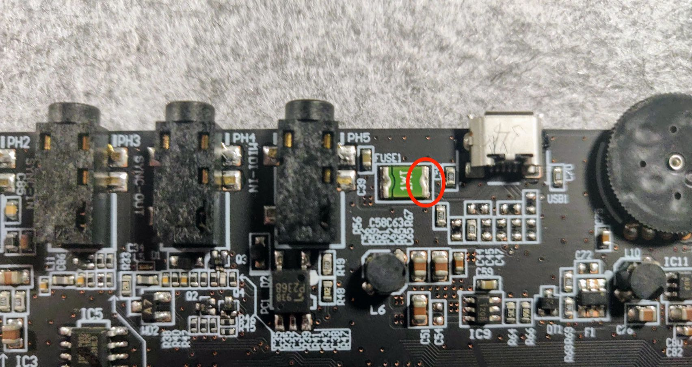

Make sure to not put too much tin, to avoid shorts with nearby components.

After that, solder the other end of this red wire to any side pin of the power switch. Pick a second red wire, and solder one end to the center pin of the power switch.

Then flip the NTS-1 board, pick the black wire, and solder one end to the USB port bottom pin (left or right side will do).

The final soldering step is to attach the wires to the battery board.

**Make sure to flip the power switch to the side where no wire is soldered before continuing!**

Before attaching the wire, you have to unsolder the dangling USB cable on the battery board. The spots should be marked as `5V+` and `5V-` on the board:

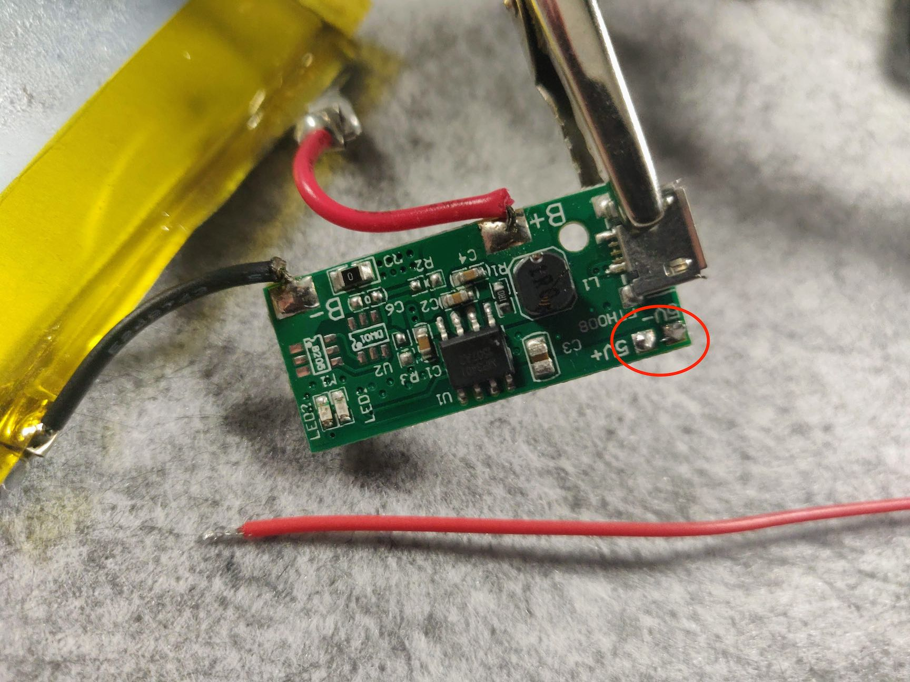

Once you the USB cable is detached, you can solder the red wire end to the `5V+` spot and the black wire end to the `5V-` spot. Be extra careful to avoid shorts here, as the circuit is powered at this point!

## Re-assemble and test

Now you can put the NTS-1 board back in place to test if everything works. The red wire than goes inside should be placed in the empty space on the top-left side of the board, as pictured here:

Before going any further, it's time to test if everything is working: flip the switch, wait a few seconds and the NTS-1 should shine its light. If it's not working, inspect every soldering spot to check if the wire is properly attached and that there's no shorts.

Add some electrical tape to the place where the battery connectors and the USB board will be, to provide an insulation layer and avoid any unwanted contacts with the NTS-1 board.

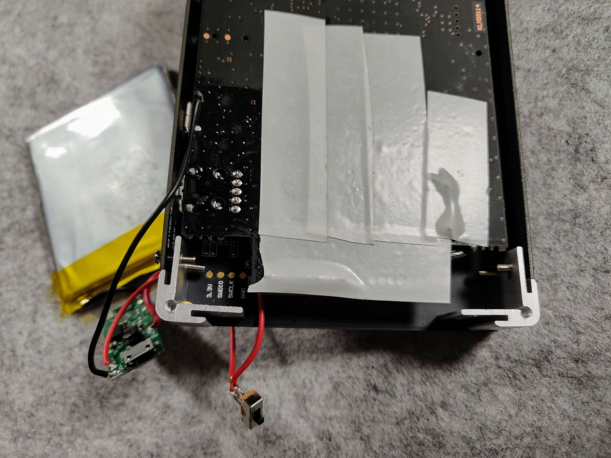

## Mount the new side panel

Now that the most difficult part is done, it's time to put the finishing touch and make the mod sturdy so you can take this little synth everywhere.

It took me quite a few tries to design a replacement panel that is both easy to mount and sturdy enough to resist many plugging in/out the USB cable to recharge the battery.

> In case you're wondering, I used the open-source 3D modelling software [Blender](https://www.blender.org) (and a lot of patience) to design this part.

All to finally end up with this little thing:

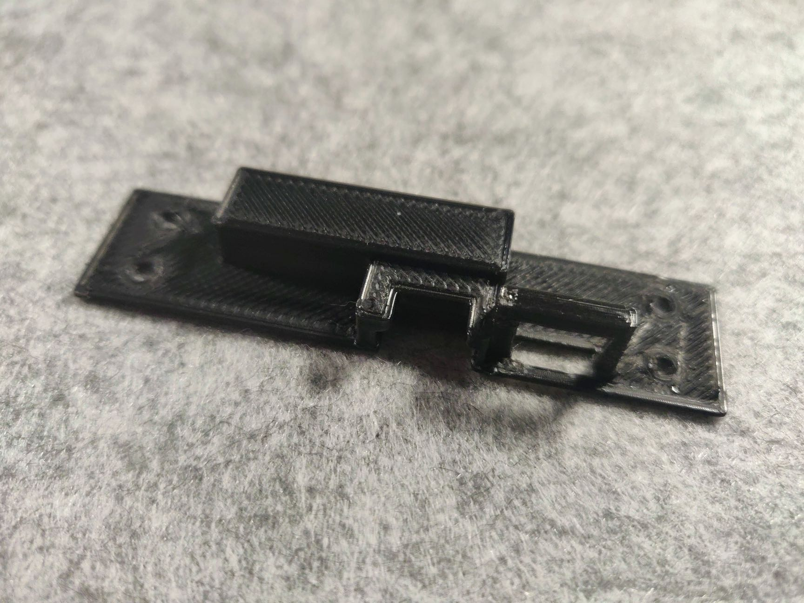

Remove the side panel on the left side (when the NTS-1 is upside down), and slide in the 3D-printed replacement panel. You'll have to gently bend it to make it slide past the upper board.

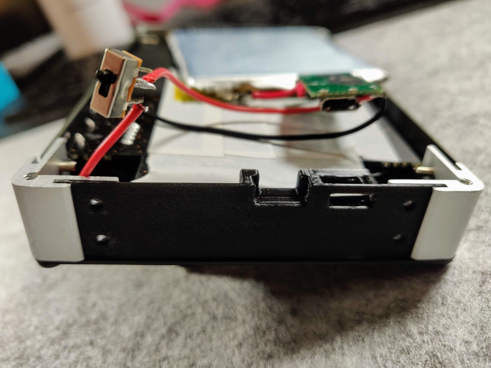

Place the wires of the battery board between the USB port and the small coil:

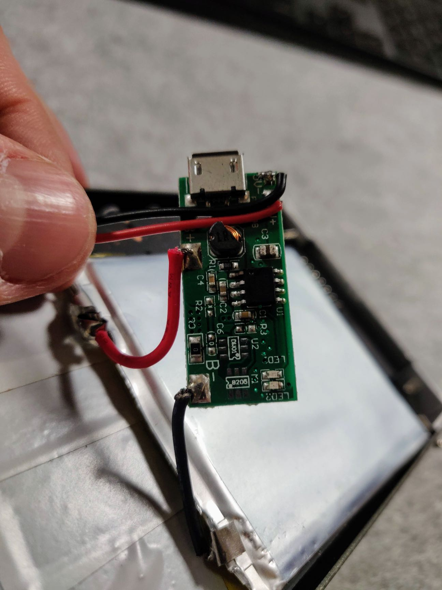

After that, place the power switch on the left hole, and fit the USB plug of the battery board on the other one. You have to force a bit to to place the USB plug as it's designed to be a tight fit. You can use a small knife to remove any small bumps due to the 3D printing if it's a bit too tight to fit. The USB plug should clip in and be vertically aligned with the hole. Once in, it should not move anymore, as opposed to the power switch which will need some glue to stay in place.

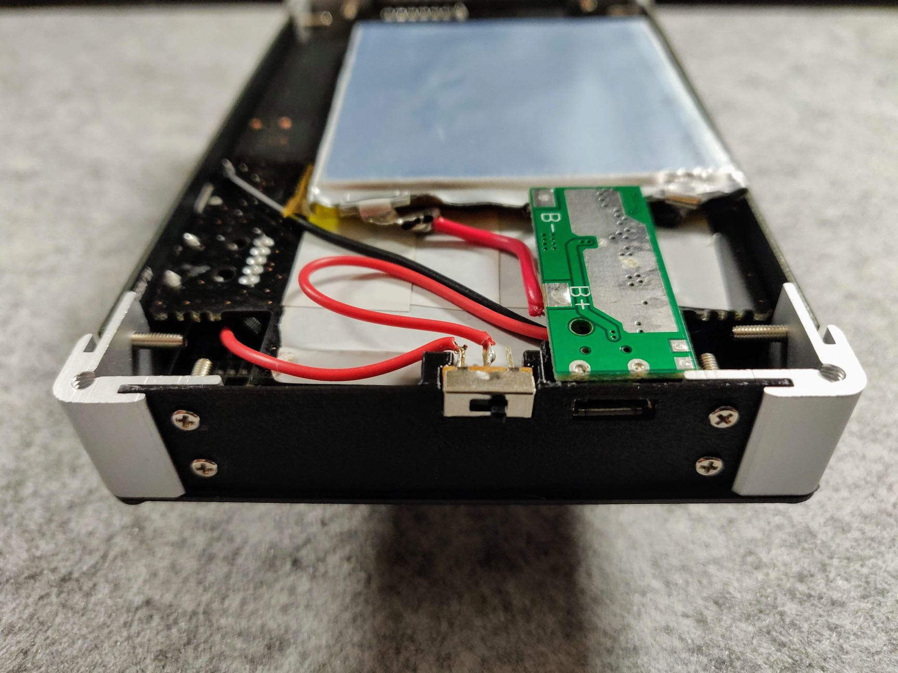

## Glue everything in place

Screw back all side panels. Then, put the battery against the side and its USB board, so it doesn't move.

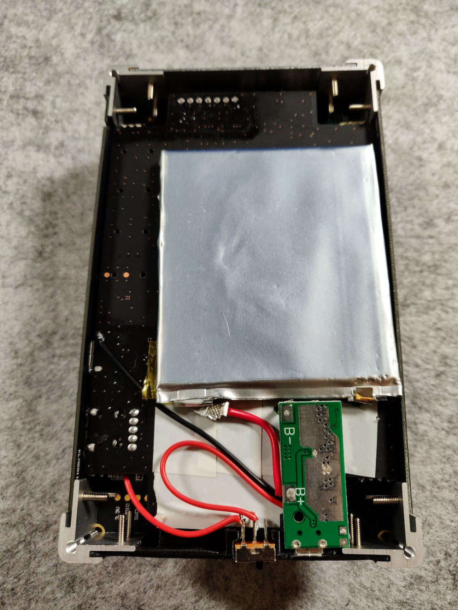

It's time to heat up your glue gun!

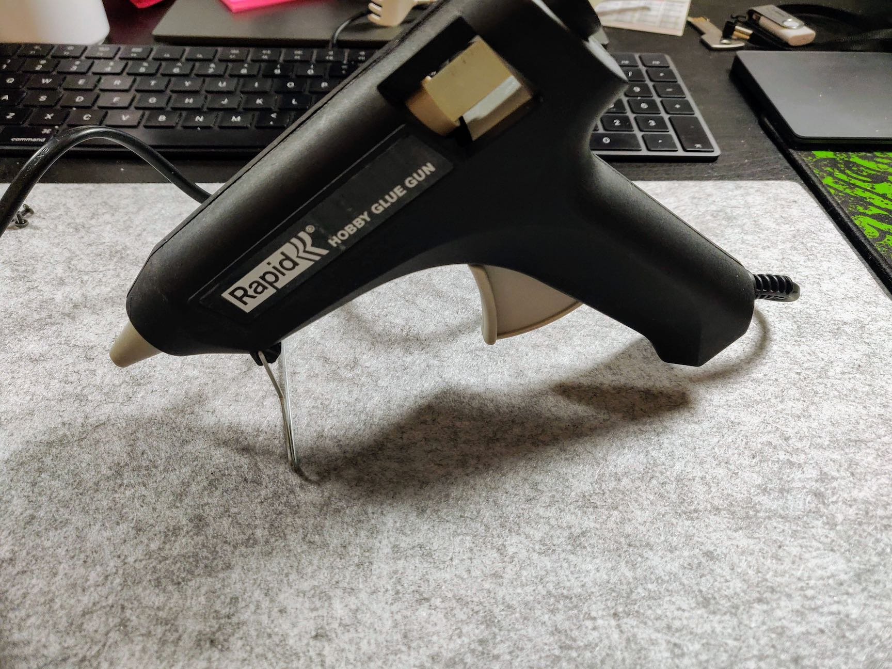

Put some glue on the power switch pin, then behind the battery and on its side to prevent it from moving. **Make sure to avoid heating the battery directly!**
Use your finger to mold the glue a bit and make it flat before it's completely cold.

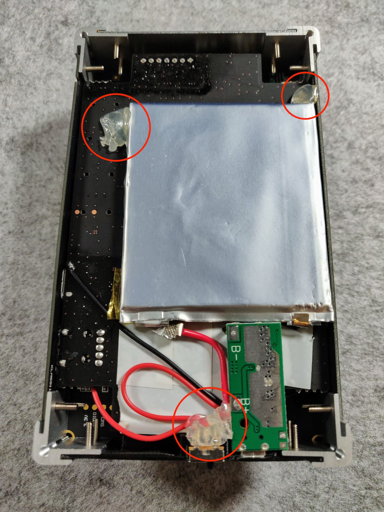

Screw back the NTS-1 back panel, and enjoy your work!

## Jam on the go

Flip the switch on and enjoy your fully portable mini-synth:

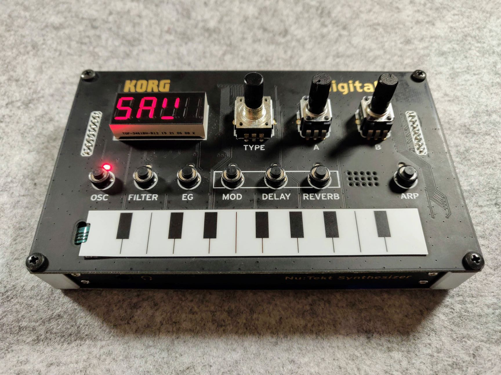

To recharge the battery, use the USB port on the side.

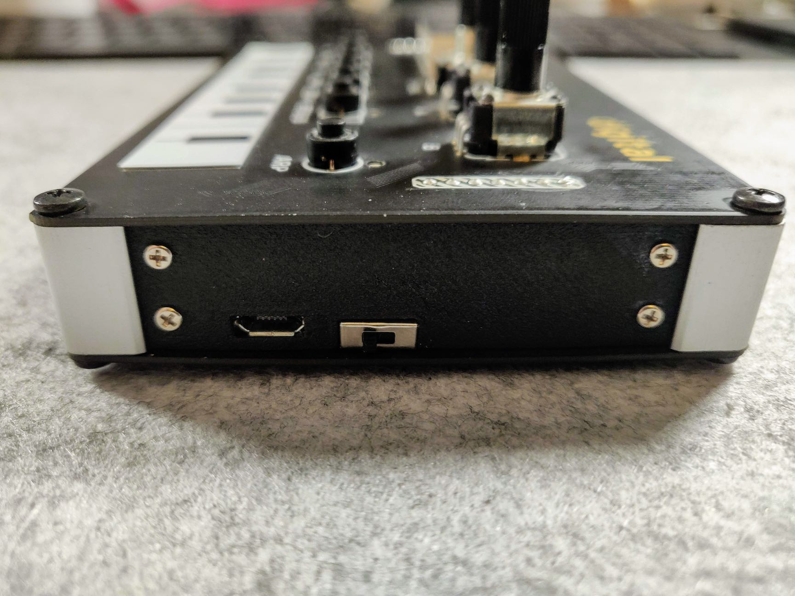

You can still use the NTS-1 plugged as usual, with the USB port on the back panel but make sure the power switch is flipped off before plugging it in.

Share your results in the comments! 🙂

---

If you like this mod, you can follow me on [Twitter](http://twitter.com/sinedied), I would be happy to discuss about it and take your suggestions!
